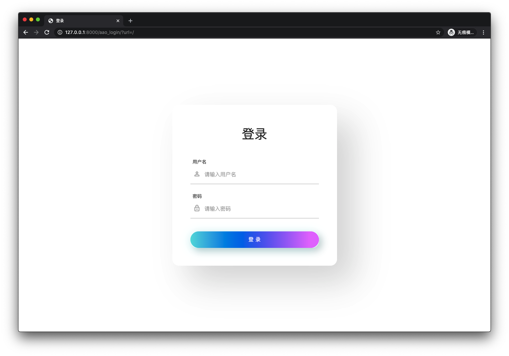

# nuaaTimetableWeb
南航课表获取网页版

## 界面




## 关于本项目

本项目在[NUAA_ClassSchedule](https://github.com/miaotony/NUAA_ClassSchedule)这个项目的基础上，使用django2.2.11版本开发。由于嫌麻烦未使用Python虚拟环境，在使用本项目的时候请参照下面的库版本：

> Django == 2.2.11
baidu-aip== 2.2.18.0

其他库的版本请参考[NUAA_ClassSchedule](https://github.com/miaotony/NUAA_ClassSchedule)中的requests.txt。

本项目使用百度文字识别api识别验证码，因而，如果你希望使用的话，请勿[百度ai开放平台](https://ai.baidu.com/tech/ocr)申请，在timetable文件夹下面的views.py中填写你的应用的AppID、API Key、Secret Key。

```python
def img_to_str1(image_path):
    # 百度文字基本识别设置
    config = {
        'appId': 'AppID',
        'apiKey': 'API Key',
        'secretKey': 'Secret Key'
    }
    client = AipOcr(**config)
    image = get_file_content(image_path)
    options = {}
    # 设置语言为英文
    options["language_type"] = "ENG"
    result = client.basicGeneral(image, options)
    if 'words_result' in result:
        return '\n'.join([w['words'] for w in result['words_result']])
```

由于我使用的是高精度版本，每天调用次数只有500次。如果你希望使用通用版的话，可以调用img_to_str1()这个函数

```python
def img_to_str1(image_path):
    # 百度文字基本识别设置
    config = {
        'appId': '19099446',
        'apiKey': 'CaKSFYkYzCl98K6hVxT1ji2q',
        'secretKey': 'cgW37s22yBcXVVCDFbA99pxy7gE8h9Pl'
    }
    client = AipOcr(**config)
    image = get_file_content(image_path)
    options = {}
    # 设置语言为英文
    options["language_type"] = "ENG"
    result = client.basicGeneral(image, options)
    if 'words_result' in result:
        return '\n'.join([w['words'] for w in result['words_result']])
```

我搭了一个在线网站：[kb.ijackyu.com](kb.ijackyu.com)，目前并没有开放注册功能，只有你把你的教务处用户名和密码告诉我，我给你添加到数据库中才能使用，后期应该也不会开放注册功能的吧，毕竟我的服务器只有1H2G，没法满足太多人的同时使用。如果你也希望使用的话，请加我的QQ：1480851073。

前端界面使用[Timetable](https://github.com/Hzy0913/Timetable)这个项目，后期有空的话会加上一些东西。

## TODO

* 前端界面优化
* 添加考试信息
* 添加班级课表